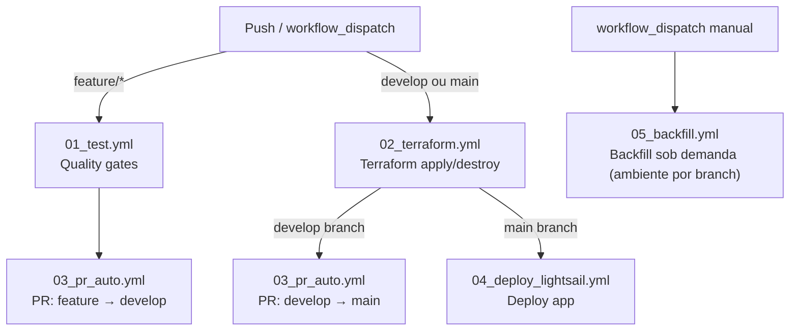

# 0. Pipeline CI/CD — Documentação do Fluxo

## Visão Geral

O pipeline automatiza as seguintes etapas a cada push no repositório:

1. **Qualidade**: lint, type check, segurança e cobertura de testes
2. **Infraestrutura**: provisiona ou destrói recursos AWS via Terraform
3. **Deploy**: publica a aplicação FilmBot no Lightsail
4. **Promoção**: cria PRs automáticos entre branches (`feature → develop → main`)

Além do fluxo automático acima, o `05_backfill.yml` é um workflow independente, disparado manualmente (`workflow_dispatch`), para reprocessar dados históricos sob demanda. O ambiente (dev/prod) é resolvido automaticamente pelo branch selecionado ao disparar o workflow.

---

## Diagrama de Fluxo



---

## Triggers

| Evento | Branch | Workflows executados |
|---|---|---|
| `push` | `feature/*` | test → PR feature→develop |
| `push` | `develop` | terraform (dev) → PR develop→main |
| `push` | `main` | terraform (prod) → deploy (prod) |
| `workflow_dispatch` | — | terraform (dev **ou** prod) → deploy apenas se ambiente = prod |
| `workflow_dispatch` (`05_backfill.yml`) | — | backfill sob demanda, ambiente resolvido pelo branch selecionado (`main`→prod, `develop`→dev) — independente do `00_pipeline.yml` |

---

## Workflows

### `00_pipeline.yml` — Orquestrador

Ponto de entrada do pipeline. Chama os outros workflows na ordem certa usando `needs:` e condicionais de branch. Um job `resolve-env` resolve o ambiente uma única vez (evitando repetir a mesma lógica nos jobs `terraform` e `deploy-lightsail`); a seleção de secrets `_DEV`/`_PROD` continua feita em cada job, pois secrets não devem transitar por outputs de job.

**Lógica de ambiente (job `resolve-env`):**

| Branch | Ambiente |
|---|---|
| `develop` | `dev` |
| `main` | `prod` |
| `workflow_dispatch` | escolha manual |

---

### `01_test.yml` — Quality Gates

Valida a qualidade do código antes de qualquer deploy. Executa **apenas em branches `feature/*`**.

| Etapa | Ferramenta | Comportamento |
|---|---|---|
| Lint | Ruff | **Bloqueia** se falhar |
| Cobertura de testes | pytest-cov | **Bloqueia** se < 80% |
| Type check | mypy | Aviso (não bloqueia) |
| Segurança do código | Bandit | Aviso (não bloqueia) |
| Vulnerabilidades em deps | Safety | Aviso (não bloqueia) |

---

### `02_terraform.yml` — Infraestrutura

Provisiona ou destrói a infraestrutura AWS.

**Entrada:** `environment` (`dev` ou `prod`)  
**Saída:** `was_destroyed` — indica se a infra foi destruída (impede o deploy)

**`infra/config/destroy_config.json`**

Controla se o workflow deve destruir (`terraform destroy`) ou provisionar (`terraform apply`) cada ambiente:

```json
{ "dev": false, "prod": false }
```

Mudar um valor para `true` faz com que o próximo push naquele ambiente execute `terraform destroy` em vez de `terraform apply`. Após a destruição, o valor **não é revertido automaticamente** — é necessário mudar de volta para `false` e fazer novo push para reaplicar a infraestrutura.

**Etapas principais:**

1. Lê `infra/config/project.json` via `jq` — nome do wheel compartilhado, nome/prefixo da role e policies de CI/CD, key do state file (fonte única de identidade do projeto, também lida diretamente pelo Terraform)
2. Build do pacote Lambda (`infra/scripts/build_lambda_package.py`), do wheel Shared e dos wheels dos módulos Glue Python Shell listados em `glue_wheel_modules` (`infra/config/project.json`, hoje: ETL, Agg, Details) — verifica se os artefatos foram gerados; adicionar um novo módulo Glue Python Shell é só incluí-lo nesse array
3. Lê `infra/config/destroy_config.json` para decidir se destrói ou aplica — valida que o valor é `true` ou `false`
4. `terraform init` com backend S3 + DynamoDB
5. **Import da role de CI/CD** — a role `lsg-github-actions-{env}` existe fora do Terraform desde antes de virar `resource` em `iam_cicd.tf`; este step adota ela no state via `terraform import` (checa `terraform state show` antes — no-op após a primeira adoção; usa `state show` de um resource específico em vez de `state list | grep` para não depender de um pipe entre dois comandos, que sob `pipefail` podia gerar falso negativo por broken pipe e reimportar uma role já adotada). Sem isso o Terraform tentaria `CreateRole` nela, que a própria role não tem permissão de fazer contra si mesma
6. `terraform validate` e `terraform fmt -check` (**bloqueantes**) + TFLint e Checkov (não-bloqueantes — apenas avisos)
7. Injeta o e-mail de notificação no `.tfvars` (não é commitado no repo)
8. **Bootstrap das IAM policies** — aplica com `-target` as 6 policies do CI/CD antes do plan principal, resolvendo o problema de bootstrap (a role precisa das policies para gerenciar os recursos, mas as policies são criadas pelo mesmo Terraform). Idempotente — se as policies já existem, é um no-op. Verifica via polling (a cada 5s, timeout 60s) com `aws iam list-attached-role-policies` se as 6 policies estão de fato attachadas à role — falha o pipeline se alguma estiver ausente
9. `terraform destroy` **ou** `terraform plan` + Infracost + `terraform apply`

**Autenticação AWS:** OIDC — assume a role `lsg-github-actions-{env}` (nome configurável via `infra/config/project.json`) com políticas de privilégio mínimo gerenciadas pelo Terraform (`iam_cicd.tf`). As variáveis `cicd_statefile_s3_bucket` e `cicd_lock_dynamodb_table` são passadas via `-var` a partir dos secrets `aws-statefile-s3-bucket` e `aws-lock-dynamodb-table`.

**Concorrência:** o job `terraform` usa `concurrency: group: terraform-{environment}` (`cancel-in-progress: false`) — runs do mesmo ambiente (ex.: dois pushes seguidos em `develop`) são enfileirados em vez de rodar em paralelo contra o mesmo state; dev e prod têm grupos separados e não se bloqueiam entre si. Evita uma corrida entre o step de import (item 5) e o lock do DynamoDB quando dois runs do mesmo ambiente coincidem.

---

### `03_pr_auto.yml` — PR Automático

Cria ou atualiza um Pull Request para promover código entre branches.

**Entrada:** `branch_name` (branch de origem)

| Branch de origem | Branch de destino |
|---|---|
| `feature/*` | `develop` |
| `develop` | `main` |

Antes de criar o PR, executa `terraform validate -backend=false` e `terraform fmt -check` — apenas em branches `feature/*`. Em `develop`, esses checks são pulados porque o `02_terraform.yml` já os executou antes do auto-pr ser chamado.

---

### `04_deploy_lightsail.yml` — Deploy da Aplicação

Publica a aplicação Streamlit (FilmBot) na instância Lightsail via SSH. Executa **apenas em `main`** (ou `workflow_dispatch` com ambiente `prod`) — o ambiente `dev` não possui instância Lightsail.

**Entrada:** `environment` (`prod`)

**Etapas principais:**

1. Lê `infra/config/project.json` via `jq` — `app_name`, `app_display_name`, `app_folder`, `statefile_key` (por padrão `filmbot`/`FilmBot`/`lightsail_ia`)
2. Lê outputs do Terraform (IP, chave SSH, credenciais AWS do agente, nome da instância, log group do CloudWatch, ARN do Secrets Manager, `ATHENA_S3_OUTPUT`/`GLUE_DATABASE`/`SPEC_TABLE`) — valida que nenhum output crítico está vazio
3. Verifica o estado da instância via `aws lightsail get-instance` — se não estiver `running` (ex: parada pelo scheduler noturno), **pula os steps de deploy** com warning (mas ainda exibe a URL do app no final)
4. Configura SSH com retry (até 30 tentativas, intervalo de 10s) — falha o pipeline se SSH não ficar disponível em 5 minutos
5. Cria `.env` na instância com variáveis de ambiente da aplicação (credenciais AWS, ARN do Secrets Manager, Athena, Glue, CloudWatch) — todas lidas dos outputs do Terraform, nenhuma hardcoded no workflow — verifica via SSH se o arquivo foi criado
6. Instala o Caddy como proxy reverso HTTPS (se ainda não instalado)
7. Deploy por SSH (`app_name`/`app_folder` passados como variáveis de ambiente da sessão SSH):
   - **Primeiro deploy**: clone do repo (URL derivada de `${{ github.repository }}`), venv, systemd services (`<app_name>` + `caddy`)
   - **Updates**: git pull, pip install, restart de ambos os services
   - Verifica se os serviços `<app_name>` e `caddy` estão ativos (`systemctl is-active`) — falha o pipeline se algum estiver inativo
8. Health check — aguarda 30s e faz `curl` no IP público para confirmar que o app está respondendo
9. Exibe a URL do app (`app_display_name`) no log e no Job Summary (clicável)

**Branch deployada por ambiente:**

| Ambiente | Branch |
|---|---|
| `dev` | `develop` |
| `prod` | `main` |

---

### `05_backfill.yml` — Backfill Manual

Workflow independente do `00_pipeline.yml`, disparado apenas manualmente (`workflow_dispatch`) para reprocessar dados históricos sob demanda. O ambiente é resolvido **automaticamente pelo branch** selecionado em "Use workflow from": `main` → prod, `develop` → dev, qualquer outro branch falha o workflow antes de configurar credenciais AWS.

**Entradas:**

| Input | Obrigatório | Default | Descrição |
|---|---|---|---|
| `table_group` | sim | — | Grupo de tabelas a atualizar (choice) |
| `start_year` | sim | `2000` | Ano inicial (ignorado para `referencias`) |
| `end_year` | não | vazio (= ano atual) | Ano final (ignorado para `referencias`) |

**Grupos de tabelas (`table_group`) e script executado:**

| `table_group` | Script | Serviço AWS |
|---|---|---|
| `discover` | `scripts/backfill_historico.py` | Lambda |
| `referencias` | `scripts/backfill_referencias.py` | Lambda |
| `detalhes_e_providers` | `scripts/backfill_enriquecimento.py` | Glue Details |
| `data_quality` | `scripts/backfill_data_quality.py` | Glue Data Quality |
| `traducao` | `scripts/backfill_traducao.py` | S3 (direto) |

**Etapas principais:**

1. Checkout + resolve o ambiente a partir do branch (`main`→prod, `develop`→dev, outro branch → falha)
2. Lê `infra/config/project.json` via `jq` — `project_prefix`
3. Autenticação AWS via OIDC — assume `AWS_ASSUME_ROLE_ARN_BACKFILL_DEV` ou `AWS_ASSUME_ROLE_ARN_BACKFILL_PROD` conforme o ambiente resolvido (role dedicada e de privilégio mínimo, separada da role de CI/CD usada pelo `00_pipeline.yml` — ver `infra/docs/iam.md`)
4. Setup Python 3.12, instala `boto3` (e `scripts/requirements_backfill.txt` apenas se `table_group == traducao`)
5. Executa o script correspondente ao `table_group` escolhido, com todas as variáveis de ambiente dos recursos AWS montadas dinamicamente como `<project_prefix>-...-<ambiente>` / `<project_prefix>_..._<ambiente>` (ex.: `tmdb-glue-details-dev`, `db_tmdb_movie_prod`) — prefixo lido de `infra/config/project.json`, ambiente resolvido pelo branch

`timeout-minutes: 360` — backfills históricos podem levar horas dependendo do volume de dados.

**Retomada automática após expiração de credencial:**

A sessão AWS assumida via OIDC dura 1h (padrão da action `configure-aws-credentials`), mas backfills como `detalhes_e_providers` podem levar várias horas. Em vez de esticar a duração da sessão, o step "Executar backfill" trata isso com dois mecanismos complementares:

- **Retry em bash**: os scripts que iteram por ano (`backfill_historico.py`, `backfill_enriquecimento.py`, `backfill_data_quality.py`, `backfill_traducao.py`) detectam `ExpiredTokenException` e saem com `exit code 75` (`scripts/backfill_checkpoint.py`). Um laço `while` no step captura esse código, renova a credencial inline via OIDC (`assume-role-with-web-identity`, nova sessão de 1h) e roda o script de novo — até `max_tentativas=6`, alinhado ao `timeout-minutes: 360` (~6 sessões de 1h). Qualquer outro código de saída propaga a falha imediatamente, sem retry. (`backfill_referencias.py` não itera por ano e nunca sai com 75 — para ele o laço roda uma única vez.)
- **Checkpoint em S3**: cada reinício acima é um processo Python novo, sem memória do progresso anterior. Para não refazer trabalho já concluído, esses mesmos scripts persistem as unidades (`tipo:ano`) já processadas com sucesso em `s3://{S3_BUCKET_SOT}/_backfill_checkpoints/{table_group}.json` a cada unidade concluída, e leem esse checkpoint no início para pular direto para as pendentes. O checkpoint é apagado ao final de um backfill sem falhas pendentes.

Se o `table_group` escolhido falhar por outro motivo (não expiração de credencial) ou esgotar as 6 tentativas, é preciso disparar o workflow manualmente de novo — ele também vai retomar do checkpoint salvo, agora numa nova execução.

---

## Promoção de Branches

```
feature/minha-feature
        ↓  (PR automático após testes passarem)
      develop
        ↓  (PR automático após terraform dev bem-sucedido)
        main
```

Cada promoção é feita via PR automático criado pelo `03_pr_auto.yml`. O merge ainda requer aprovação manual.

---

## Secrets e Variáveis

| Secret | Ambiente | Uso |
|---|---|---|
| `AWS_ASSUME_ROLE_ARN_DEV` / `_PROD` | dev / prod | OIDC — autenticação AWS (role de CI/CD, `00_pipeline.yml`) |
| `AWS_ASSUME_ROLE_ARN_BACKFILL_DEV` / `_PROD` | dev / prod | OIDC — autenticação AWS (role de backfill manual, `05_backfill.yml`) |
| `AWS_STATEFILE_S3_BUCKET_DEV` / `_PROD` | dev / prod | Backend Terraform (estado) |
| `AWS_LOCK_DYNAMODB_TABLE_DEV` / `_PROD` | dev / prod | Lock do estado Terraform |
| `AWS_FILMBOT_SECRET_ARN_DEV` / `_PROD` | dev / prod | ARN do segredo unificado no Secrets Manager (tmdb_api_key, llm_api_key, filmbot_password) |
| `NOTIFICATION_EMAIL` | ambos | E-mails de alerta da infra |
| `INFRACOST_API_KEY` | ambos | Estimativa de custo no PR |

---

## Glossário técnico

| Termo | O que é |
|---|---|
| **OIDC** | Método de autenticação sem chaves estáticas. O GitHub Actions prova sua identidade para a AWS via token temporário — mais seguro que guardar `AWS_ACCESS_KEY` em secrets. |
| **Backend Terraform** | Local onde o Terraform guarda o *state file* — arquivo que mapeia o que foi criado na AWS. Aqui é um bucket S3 com lock via DynamoDB para evitar conflito quando duas pessoas rodam o Terraform ao mesmo tempo. |
| **ARN** | Amazon Resource Name — identificador único de qualquer recurso AWS (ex: `arn:aws:secretsmanager:us-east-1:123456:secret:tmdb-key`). |
| **TFLint** | Linter para código Terraform — detecta erros de configuração e boas práticas sem precisar aplicar nada na AWS. |
| **Checkov** | Scanner de segurança para IaC (Terraform, CloudFormation) — detecta configurações inseguras como buckets S3 públicos ou IAM permissivo demais. |
| **Infracost** | Estima o custo mensal da infraestrutura AWS antes de aplicar — exibe o delta de custo no comentário do PR. |
| **PR automático** | Pull Request criado pelo próprio pipeline (`03_pr_auto.yml`) para promover código entre branches. O merge ainda requer aprovação manual, mas a criação do PR é automatizada para não depender de nenhum desenvolvedor. |
| **`terraform destroy`** | Destrói todos os recursos AWS gerenciados pelo Terraform naquele ambiente — o inverso do `apply`. Usado para desligar o ambiente e parar de pagar. Controlado pelo `infra/config/destroy_config.json`. |

---

## Troubleshooting — Problemas comuns

| Problema | Causa provável | Solução |
|---|---|---|
| Terraform apply falha com "Access Denied" ou "permission denied" | A role OIDC (`lsg-github-actions-{env}`) não tem todas as 6 policies do `iam_cicd.tf` attached | Verifique com `aws iam list-attached-role-policies --role-name lsg-github-actions-{env}` e compare com as 6 policies definidas em `iam_cicd.tf` |
| Terraform apply falha com `AccessDenied: ... iam:CreateRole ... lsg-github-actions-{env}` | O step "Import da role de CI/CD" (item 5 de `02_terraform.yml`) não rodou ou falhou antes de adotar a role existente no state | Confirme que o step de import rodou com sucesso no log; se a role realmente não existir ainda na AWS para esse ambiente, crie-a manualmente antes do próximo run (ela não pode se auto-criar) |
| Testes passam no CI mas falham localmente (ImportError) | `sys.path` não está configurado corretamente | Rode `pytest` da raiz do projeto (não de dentro de `test/`). O `test/conftest.py` raiz gerencia os imports automaticamente |
| Testes falham localmente mas passam no CI | Versão do Python diferente ou dependências desatualizadas | Verifique que está usando Python 3.12+ e instale as dependências de cada módulo: `for req in app/*/requirements.txt test/*/requirements_tests.txt; do pip install -r "$req"; done` |
| Deploy Lightsail trava no step de SSH | Instância pode estar `stopped` pelo Lambda Lightsail Scheduler | Verifique o estado com `aws lightsail get-instance --instance-name {nome}`. O scheduler desliga a instância fora do horário de uso |
| `05_backfill.yml` falha com `AccessDenied` | A role `tmdb-backfill-role-{env}` não tem a permissão específica exercida pelo `table_group` escolhido | Confira o `eventName` negado no CloudTrail e adicione a action/recurso faltante na policy inline correspondente em `infra/iam_backfill.tf` |
| `terraform destroy` rodou sem querer | Flag `true` em `infra/config/destroy_config.json` não foi revertida | Mude o valor de volta para `false` e faça push para reaplicar a infraestrutura |
| Build Lambda falha com "directory is empty" | Erro no script `build_lambda_package.py` (dependências não instaladas) | Verifique se `pip install` no CI está usando a versão correta do Python e se o `requirements.txt` está atualizado |
